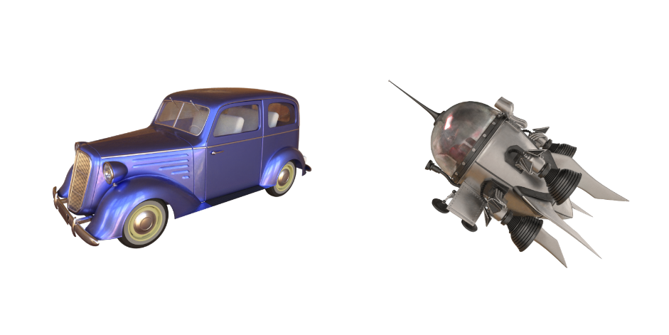

# Jittor 可微渲染新视角生成赛题




## 简介

本项目包含了第二届计图挑战赛计图 - 可微渲染新视角生成比赛的代码实现。本项目的特点是：通过相机参数自适应调整的Nerf模型，获取了调整后的相机参数，并使用 instant ngp 进行训练，得到了在 Car 和 Easyship 场景下较好的结果。

## 安装 

单个场景在 1 张 3090 上的训练时间约为 1 小时，5 个场景大约需要 6 个小时。

#### 运行环境
- ubuntu 20.04 LTS
- python >= 3.7
- jittor >= 1.3.0

#### 安装依赖
请参考 [JNerf](https://github.com/Jittor/JNeRF) 的具体安装方法。

#### 预训练模型
本项目提供比赛的预训练模型，需要通过百度网盘进行下载 [Link](https://pan.baidu.com/s/1ugSL1QPrvCEkV9pTVp_irw?pwd=gd7y)，下载后放入目录 `./logs/test/$scene/` 下。

## 数据预处理

数据集请参考原始 [Nerf](https://github.com/bmild/nerf) 的格式，将数据下载解压到 `./data` 下。


## 训练

要进行 5 个场景的依次训练，请运行以下命令：
```
bash train.sh
```

## 推理

生成测试集上的结果可以运行以下命令：

```
python test.py
```

## 致谢

此项目基于以下已经开源的项目：
- [Instant-NGP](https://github.com/NVlabs/instant-ngp)
- [tiny-cuda-nn](https://github.com/NVlabs/tiny-cuda-nn)
- [Eigen](https://github.com/Tom94/eigen)
- [JNerf](https://github.com/Jittor/JNeRF)
- [JaxNerf](https://github.com/google-research/google-research/tree/master/jaxnerf)

## 参考文献


```
@article{hu2020jittor,
  title={Jittor: a novel deep learning framework with meta-operators and unified graph execution},
  author={Hu, Shi-Min and Liang, Dun and Yang, Guo-Ye and Yang, Guo-Wei and Zhou, Wen-Yang},
  journal={Science China Information Sciences},
  volume={63},
  number={222103},
  pages={1--21},
  year={2020}
}
@article{mueller2022instant,
    author = {Thomas M\"uller and Alex Evans and Christoph Schied and Alexander Keller},
    title = {Instant Neural Graphics Primitives with a Multiresolution Hash Encoding},
    journal = {ACM Trans. Graph.},
    issue_date = {July 2022},
    volume = {41},
    number = {4},
    month = jul,
    year = {2022},
    pages = {102:1--102:15},
    articleno = {102},
    numpages = {15},
    url = {https://doi.org/10.1145/3528223.3530127},
    doi = {10.1145/3528223.3530127},
    publisher = {ACM},
    address = {New York, NY, USA},
}
@inproceedings{mildenhall2020nerf,
  title={NeRF: Representing Scenes as Neural Radiance Fields for View Synthesis},
  author={Ben Mildenhall and Pratul P. Srinivasan and Matthew Tancik and Jonathan T. Barron and Ravi Ramamoorthi and Ren Ng},
  year={2020},
  booktitle={ECCV},
}
```
